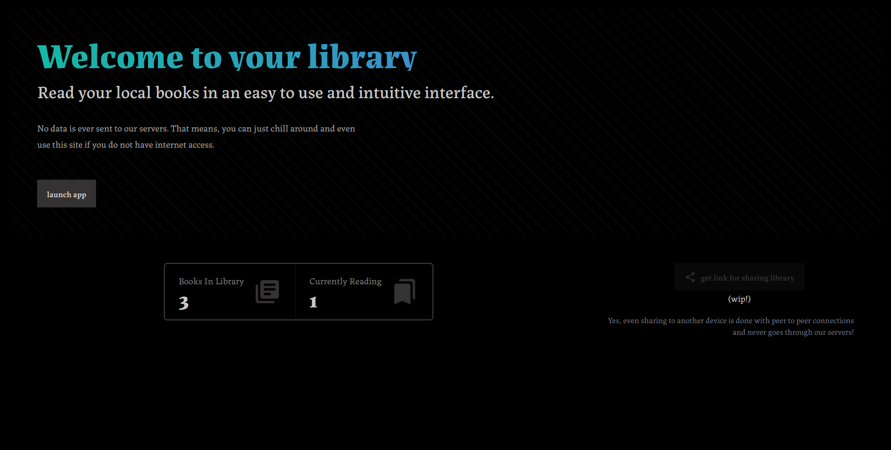
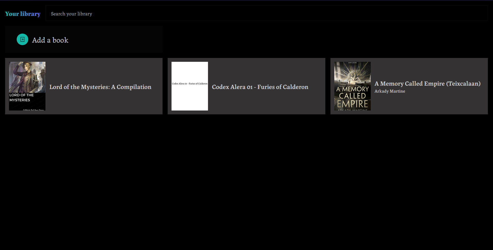

## Your very own private library
This is a reading app that you can use on-device, meaning, this does not send your data off-device, providing absolute privacy.

This is achevied by parsing and rendering the EPUB contents in-browser.

This is also provided as a PWA, which in turn allows us to install this website as an app and offline accessibility.

### Screenshots




### How to get started?

Simply clone the repo, install the dependencies and start hacking away.
```
git clone git@github.com:ikariiin/grit.git
cd grit
yarn install
```
You can start the development server by
```
yarn dev
```
Or build the project using
```
yarn build
```
### Tasklist

The features to implement and bug reports go into the issue tracker.
